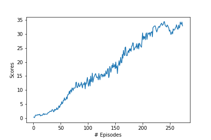

# Unveiling Mastery: A Journey into Continuous Control with Reinforcement Learning

Author: [Neel Gandhi](http://github.com/neelgandhi108)

The trained agent's performance can be observed in the following animation:

The most successful outcome was achieved using the DDPG algorithm, where a reward of +30 was reached in a yet-to-be-filled number of episodes. It's crucial to note that finding the right hyperparameters is a complex task, and even slight adjustments can significantly impact results. The reward progression throughout episodes is visualized in the graph below:

## Introduction

In this project, we delve into the fascinating realm of Continuous Control using Reinforcement Learning techniques. The primary environment we're working with is the [Reacher](https://github.com/Unity-Technologies/ml-agents/blob/master/docs/Learning-Environment-Examples.md#reacher) environment, which offers a complex task where a double-jointed arm needs to move to target locations. Each step where the arm remains in the goal location yields a reward of +0.1, and our mission is to help the agent maximize its rewards by effectively controlling its actions.

## Environment Overview

In the Reacher environment, the agent interacts with the surroundings through a continuous state space comprising 33 variables, representing the arm's position, rotation, velocity, and angular velocities. The agent can perform actions as a vector with four values, which correspond to applying torque to the arm's joints. Notably, these torque values must be within the range of -1 to 1.

## Distributed Training

For our experiments, we have access to two versions of the Unity environment:

1.  **Single Agent Version**: This version focuses on training a single agent to perform the task.
2.  **Multi-Agent Version**: Here, we deal with 20 identical agents, each with an independent copy of the environment. This version is beneficial for algorithms like [PPO](https://arxiv.org/pdf/1707.06347.pdf), [A3C](https://arxiv.org/pdf/1602.01783.pdf), and [D4PG](https://openreview.net/pdf?id=SyZipzbCb), which leverage parallel agents to gather experience.

## Solving the Environment

We have two options for solving the environment:

1.  **Single Agent Version**: To solve this version, our agent must achieve an average score of +30 over 100 consecutive episodes.
2.  **Multi-Agent Version**: In this case, we aim for an average score of +30 (across all 20 agents) over 100 consecutive episodes.

## Getting Started

To begin, you need to download the appropriate environment for your operating system:

-   **_Version 1: Single Agent_**
    
    -   Linux: [Download](https://s3-us-west-1.amazonaws.com/udacity-drlnd/P2/Reacher/one_agent/Reacher_Linux.zip)
    -   Mac OSX: [Download](https://s3-us-west-1.amazonaws.com/udacity-drlnd/P2/Reacher/one_agent/Reacher.app.zip)
    -   Windows (32-bit): [Download](https://s3-us-west-1.amazonaws.com/udacity-drlnd/P2/Reacher/one_agent/Reacher_Windows_x86.zip)
    -   Windows (64-bit): [Download](https://s3-us-west-1.amazonaws.com/udacity-drlnd/P2/Reacher/one_agent/Reacher_Windows_x86_64.zip)
-   **_Version 2: Multi-Agent_**
    
    -   Linux: [Download](https://s3-us-west-1.amazonaws.com/udacity-drlnd/P2/Reacher/Reacher_Linux.zip)
    -   Mac OSX: [Download](https://s3-us-west-1.amazonaws.com/udacity-drlnd/P2/Reacher/Reacher.app.zip)
    -   Windows (32-bit): [Download](https://s3-us-west-1.amazonaws.com/udacity-drlnd/P2/Reacher/Reacher_Windows_x86.zip)
    -   Windows (64-bit): [Download](https://s3-us-west-1.amazonaws.com/udacity-drlnd/P2/Reacher/Reacher_Windows_x86_64.zip)

After downloading, place the file in the designated directory and unzip it.

## Training the Agent

For detailed instructions on how to train your agent, refer to the `Continuous_Control_DDPG.ipynb` notebook. This notebook will guide you through the process of training your agent to achieve remarkable control in the Reacher environment.

## Concluding Thoughts

With the foundation laid in this project, we have explored the realm of Continuous Control in Reinforcement Learning. By mastering the control of agents in complex environments, we are equipped to tackle a wide range of challenges that demand precise and continuous actions.
