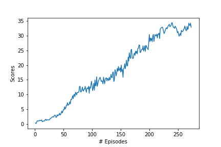

#   Unveiling Mastery: A Journey into Continuous Control with Reinforcement Learning

In this project, we delve into the world of continuous control using reinforcement learning techniques, specifically focusing on policy-based methods. The objective is to train an agent to master controlling a double-jointed arm in a Unity environment, where the arm needs to maintain its position at a target location over a sequence of time steps. By employing these methods, we seek to develop an effective policy that maximizes the cumulative reward attained by the agent.

## Implementation

At the core of this project lies the actor-critic approach, a class of reinforcement learning algorithms that combines elements from both value-based and policy-based methods. Unlike purely value-based or purely policy-based methods, which tend to exhibit high variance or high bias, respectively, actor-critic methods aim to strike a balance between these two aspects.

In our context, the "actor" represents a neural network that learns the optimal policy by producing deterministic actions, while the "critic" evaluates the policy's performance by estimating the expected cumulative reward. The critic's evaluation informs the updates made to the actor's policy.

We employ the [Deep Deterministic Policy Gradient (DDPG)](https://arxiv.org/abs/1509.02971) algorithm, a variant of the actor-critic approach. DDPG introduces several key concepts:

-   **Fixed Targets**: Inspired by value-based algorithms like DQN, DDPG employs fixed target networks for both the actor and the critic. This involves using separate target networks for stability during learning.
    
-   **Soft Updates**: Instead of directly copying weights, DDPG performs soft updates to the target networks. This entails gradually blending the local network weights with the target network weights, promoting smoother and more stable learning.
    
-   **Experience Replay**: To ensure that the learning process benefits from diverse experiences, we utilize an experience replay buffer. This buffer stores a history of interactions, allowing us to sample experiences randomly for training.
    

In the context of training multiple agents, an update to the actor's weights is performed after every 20 steps, with each update involving 10 weight adjustments. Additionally, techniques like batch normalization and Leaky ReLU activation functions are incorporated into the networks for improved training.

## Hyperparameters

A careful selection of hyperparameters greatly influences the learning process. The values chosen for various hyperparameters in our experiment are as follows:

Hyperparameter

Value

Replay buffer size

1e6

Batch size

1024

Discount factor ($\gamma$)

0.99

Soft update rate ($\tau$)

1e-3

Actor learning rate

1e-4

Critic learning rate

3e-4

Update interval

20

Number of updates per interval

10

Number of episodes

500

Max timesteps per episode

1000

Leaky ReLU slope

0.01

## Results

The trained agent's performance can be observed in the following animation:

The most successful outcome was achieved using the DDPG algorithm, where a reward of +30 was reached in a yet-to-be-filled number of episodes. It's crucial to note that finding the right hyperparameters is a complex task, and even slight adjustments can significantly impact results. The reward progression throughout episodes is visualized in the graph below:

## Ideas for Improvement

To further enhance the performance and robustness of the learning process, several avenues for improvement can be explored:

-   **Prioritized Replay**: Utilizing prioritized experience replay, where experiences are sampled based on their importance, can enhance learning efficiency.
    
-   **Alternative Algorithms**: Algorithms like Trust Region Policy Optimization (TRPO), Proximal Policy Optimization (PPO), Advantage Actor-Critic (A2C), and Asynchronous Advantage Actor-Critic (A3C) could potentially yield better results.
    
-   **Q-Prop Algorithm**: Investigating the Q-Prop algorithm, which combines both off-policy and on-policy learning, might lead to improved learning dynamics.
    
-   **Optimization Techniques**: Incorporating general optimization techniques like cyclical learning rates and warm restarts could contribute to more effective training.
    

By embarking on these avenues for improvement, we can further unlock the potential of continuous control using reinforcement learning techniques and push the boundaries of agent performance.